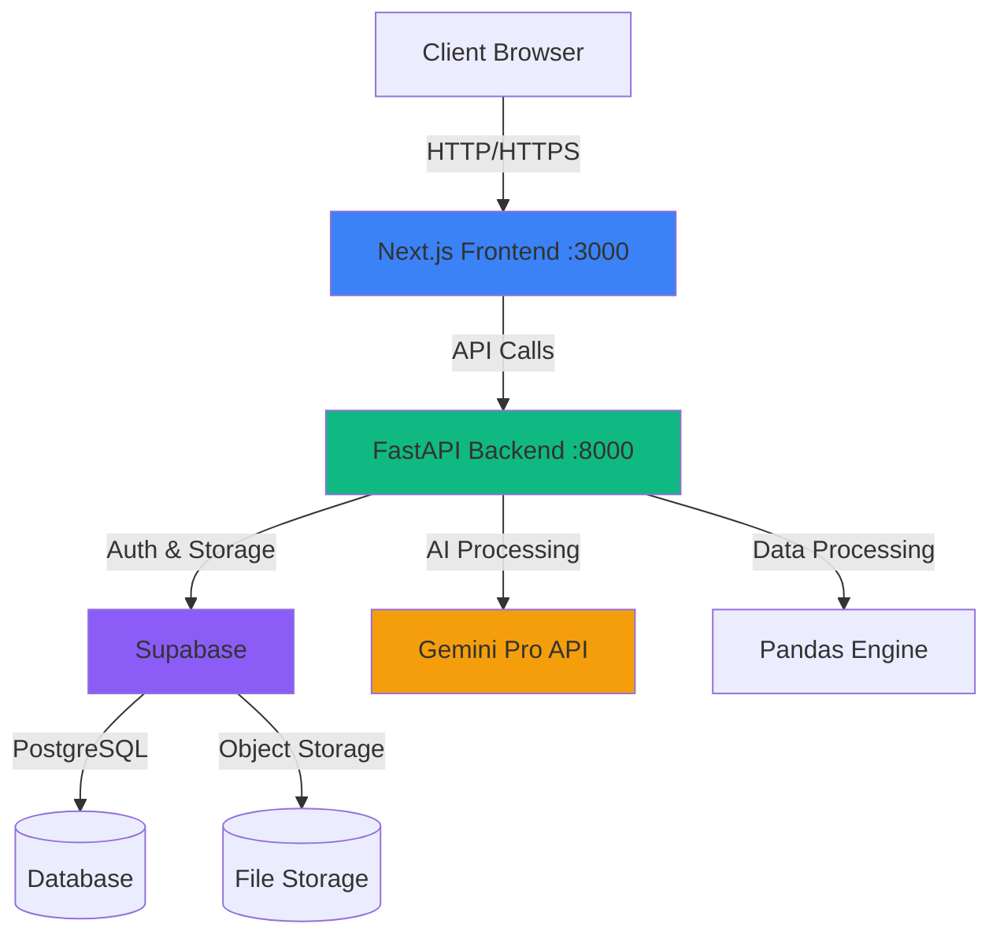

# Sichelgaita.AI - Data Wealth Platform

A modern data analytics platform that transforms raw data into actionable insights using AI-powered analysis.

## 🏗️ Architecture Overview



## 🚀 Tech Stack

### Frontend
- **Next.js 14+** - React framework with App Router
- **TypeScript** - Type-safe development
- **Tailwind CSS** - Utility-first styling
- **Shadcn/ui** - Beautiful, accessible components
- **Recharts** - Data visualizations
- **Supabase Client** - Authentication and data access

### Backend
- **FastAPI** - Modern Python web framework
- **Pandas** - Data processing and analysis
- **Google Gemini Pro** - AI-powered insights
- **Supabase** - Database and authentication
- **Poetry** - Dependency management

### Infrastructure
- **Supabase** - PostgreSQL database, authentication, storage
- **Monorepo** - Unified workspace structure

## 📋 Prerequisites

Before you begin, ensure you have the following installed:
- **Node.js** 18.17.0 or higher
- **Python** 3.11 or higher
- **Poetry** - Python dependency management
- **npm** or **pnpm** - Node package manager
- **Git** - Version control

## 🎯 Quick Start

### 1. Clone and Setup Environment

```bash
# Clone the repository
git clone <repository-url>
cd sichelgaita.ai

# Copy environment file and configure
cp .env.example .env
# Edit .env and add your API keys for Supabase and Gemini
```

### 2. Install Dependencies

```bash
# Install root dependencies
npm install

# Install frontend dependencies
cd frontend
npm install
cd ..

# Install backend dependencies
cd backend
poetry install
cd ..
```

### 3. Start Development Servers

```bash
# From root directory - starts both frontend and backend
npm run dev

# Or start individually:
npm run dev:frontend  # Frontend only (http://localhost:3000)
npm run dev:backend   # Backend only (http://localhost:8000)
```

### 4. Access the Application

- **Frontend**: http://localhost:3000
- **Backend API**: http://localhost:8000
- **API Documentation**: http://localhost:8000/docs (Swagger UI)
- **API Redoc**: http://localhost:8000/redoc

## 📁 Project Structure

```
sichelgaita.ai/
├── frontend/                 # Next.js frontend application
│   ├── src/
│   │   ├── app/             # App Router pages and layouts
│   │   ├── components/      # React components
│   │   │   └── ui/         # Shadcn/ui components
│   │   ├── lib/            # Utility functions
│   │   └── types/          # TypeScript types
│   ├── public/             # Static assets
│   ├── package.json
│   ├── tsconfig.json
│   ├── tailwind.config.ts
│   └── next.config.js
│
├── backend/                 # FastAPI backend application
│   ├── app/
│   │   ├── main.py         # FastAPI app entry point
│   │   ├── core/           # Core configurations
│   │   │   └── config.py   # Settings management
│   │   ├── api/            # API endpoints
│   │   │   └── v1/        # API version 1
│   │   ├── services/       # Business logic
│   │   └── models/         # Data models
│   ├── tests/              # Test suite
│   ├── pyproject.toml      # Poetry configuration
│   └── poetry.lock
│
├── .env.example            # Environment variables template
├── .gitignore             # Git ignore rules
├── package.json           # Root package.json with workspaces
├── setup.sh               # Unix/Mac setup script
├── setup.ps1              # Windows setup script
└── README.md              # This file
```

## 💻 Development Commands

### Root Level
```bash
npm run dev              # Start both frontend and backend
npm run dev:frontend     # Start only frontend
npm run dev:backend      # Start only backend
npm run build           # Build frontend for production
npm run lint            # Lint both frontend and backend
```

### Frontend (cd frontend/)
```bash
npm run dev             # Development server (http://localhost:3000)
npm run build           # Production build
npm run start           # Start production server
npm run lint            # ESLint check
```

### Backend (cd backend/)
```bash
poetry run uvicorn app.main:app --reload    # Development server (http://localhost:8000)
poetry run pytest                           # Run tests
poetry run black .                          # Format code
poetry run ruff check .                     # Lint code
poetry run mypy .                           # Type checking
```

## 🔧 Configuration

### Environment Variables

Copy `.env.example` to `.env` and configure the following:

- **Supabase**: Project URL, anon key, service role key
- **Gemini AI**: API key and model selection
- **Application**: API URLs and CORS origins
- **Database**: PostgreSQL connection string

### Supabase Setup

1. Create a new project at [supabase.com](https://supabase.com)
2. Copy your project URL and API keys to `.env`
3. Set up database schema (instructions in future phases)

### Gemini AI Setup

1. Get an API key from [Google AI Studio](https://makersuite.google.com/app/apikey)
2. Add the key to your `.env` file

## 🧪 Testing

### Frontend Testing
```bash
cd frontend
npm run test
```

### Backend Testing
```bash
cd backend
poetry run pytest
poetry run pytest --cov  # With coverage report
```

## 🚀 Deployment

### Frontend (Vercel recommended)
```bash
cd frontend
npm run build
# Deploy to Vercel, Netlify, or your preferred platform
```

### Backend (Docker/Cloud recommended)
```bash
cd backend
# Build Docker image or deploy to cloud platform
```

## 🤝 Development Workflow

### Branching Strategy
- `main` - Production-ready code
- `develop` - Integration branch
- `feature/*` - New features
- `bugfix/*` - Bug fixes
- `hotfix/*` - Emergency fixes

### Commit Convention
Follow [Conventional Commits](https://www.conventionalcommits.org/):
```
feat: add new data visualization component
fix: resolve authentication issue
docs: update API documentation
chore: update dependencies
```

## 📚 Additional Resources

- [Next.js Documentation](https://nextjs.org/docs)
- [FastAPI Documentation](https://fastapi.tiangolo.com/)
- [Supabase Documentation](https://supabase.com/docs)
- [Gemini API Documentation](https://ai.google.dev/docs)
- [Tailwind CSS Documentation](https://tailwindcss.com/docs)
- [Shadcn/ui Documentation](https://ui.shadcn.com/)

## 📝 License

MIT

## 👥 Contributors

Your team members here

---

Built with ❤️ using Next.js, FastAPI, and Supabase
